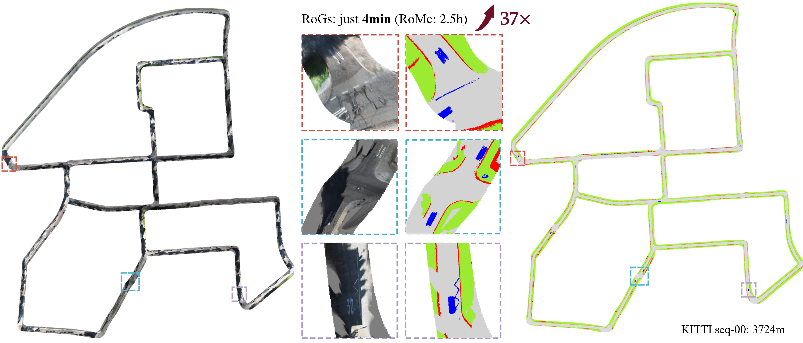

# RoGs: Large Scale Road Surface Reconstruction with Meshgrid Gaussian

<p align="center">
    <!-- project badges -->
    <a href="https://github.com/fzhiheng/RoGS.git"></a>
    <!-- paper badges -->
    <a href="https://arxiv.org/abs/2405.14342">
        
    </a>
</p>

<p align="center">
  
</p>


## Setup

### Clone the repo.

```bash
git clone https://github.com/anchun/RoGS.git
```

### Environment setup 

1. ```bash
   conda create -n rogs python=3.10.16 -y
   conda activate rogs
   pip3 install torch torchvision torchaudio --index-url https://download.pytorch.org/whl/cu128
   pip install numpy==1.26.4 opencv-python==4.10.0.82
   pip install addict PyYAML tqdm scipy pytz plyfile  pyrotation pyquaternion nuscenes-devkit open3d mediapy
   ```

2. Install [pytorch3d](https://github.com/facebookresearch/pytorch3d/blob/main/INSTALL.md).

3. Install the diff-gaussian-rasterization with orthographic camera

   ```bash
   git clone --recursive https://github.com/fzhiheng/diff-gs-depth-alpha.git && cd diff-gs-depth-alpha
   python setup.py install
   cd ..
   ```

   

4. Install the diff-gaussian-rasterization to optimize semantic

   In order to optimize the semantic and try not to lose performance (there is some performance loss in dynamically allocating memory when the channel does not need to be specified). We still use the library above. Only a few changes are needed.

   ```bash
   git clone --recursive https://github.com/fzhiheng/diff-gs-depth-alpha.git diff-gs-label && cd diff-gs-label
   mv diff_gaussian_rasterization diff_gs_label
   
   # follow the instructions below to modify the file
   
   python setup.py install
   ```

   Set `NUM_CHANNELS` in file `cuda_rasterizer/config.h` to `num_class` ( 7 for nuScenes and 5 for KITTI) and change all `diff_gaussian_rasterization` in `setup.py`  to `diff_gs_label`.    On the dataset KITTI, we changed the name of the library to `diff_gs_label2` .  In practice,  you can set `NUM_CHANNELS` according to the category of your semantic segmentation and change the name of the library.


## Dataset

### nuScenes

In `configs/local_nusc.yaml` and `configs/local_nusc_mini.yaml`

- `base_dir`: Put official nuScenes here, e.g. `{base_dir}/v1.0-trainval`

- `image_dir`: Put segmentation results here.   to generate segmentation:

  ```bash
  git clone git@github.com:facebookresearch/detectron2.git
  cd detectron2
  pip install -v -e .
  cd ~/src/
  git clone git@github.com:facebookresearch/Mask2Former.git
  cd Mask2Former
  pip install -r requirements.txt
  cd mask2former/modeling/pixel_decoder/ops
  # change value.type() to value.scalar_type() before build in /mask2former/modeling/pixel_decoder/ops/src/cuda/ms_deform_attn_cuda.cu
  sh make.sh

  python ./preprocess/segmentation/process_segmentation.py --base_dir ~/data/nuscenes-mini/ --save_dir ~/data/nuscenes-mini/nuScenes_clip/ --scene_names scene-0655
  ```

- `road_gt_dir`：Put ground truth here. To produce ground truth:

  ```bash
  python ./preprocess/process_nuscenes.py --base_dir ~/data/nuscenes-mini/ --seg_dir ~/data/nuscenes-mini/nuScenes_clip --save_dir ~/data/nuscenes-mini/nuScenes_road_gt -v mini --scene_names scene-0655
  ```

### KITTI

In `configs/local_kitti.yaml` 

- `base_dir`: Put official kitti odometry dataset here, e.g. `{base_dir}/sequences`

- `image_dir`: Put segmentation results here. We use the  segmentation results  provided by Rome.  You can download [here](https://drive.google.com/file/d/1tSgxztLtN3vu1mocfLA0rHsURF8zW6uW/view?usp=sharing). 

- `pose_dir`: Put kitti odometry pose here, e.g. `{pose_dir}/dataset/poses`

  

## Optimization

```bash
python train.py --config configs/local_nusc_mini.yaml
```
## mesh rendering

```bash
python mesh_render.py --model_path path_to_output_folder_contains_the model
```

## Citation

```
@article{feng2024rogs,
  title={RoGs: Large Scale Road Surface Reconstruction with Meshgrid Gaussian},
  author={Feng, Zhiheng and Wu, Wenhua and Deng, Tianchen and Wang, Hesheng},
  journal={arXiv preprint arXiv:2405.14342},
  year={2024}
}
```


## Acknowledgements

This project largely references [3D Gaussian Splatting](https://github.com/graphdeco-inria/gaussian-splatting) and [RoMe](https://github.com/DRosemei/RoMe). Thanks for their amazing works!
